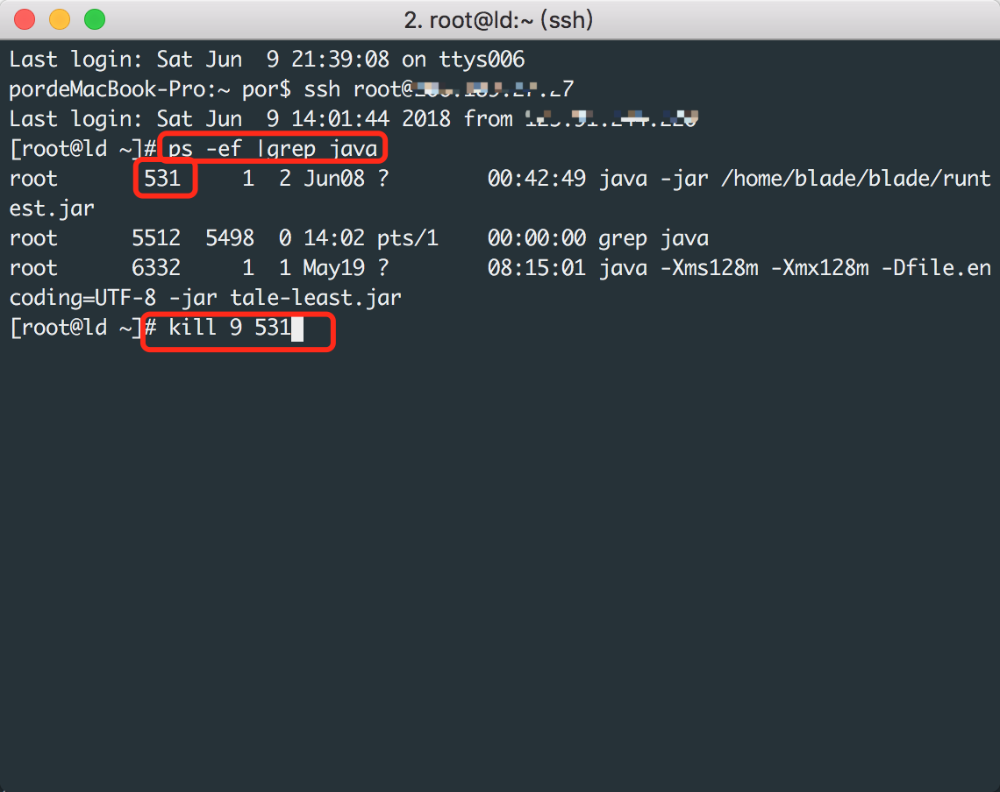

# EasyCourse-Back-End
介绍：轻课的Restful Java后端，由Blade强力驱动，主要是POST和GET请求，通讯报文使用json

部分接口声明：http://zhaoweihao.com:9001/api

建议配合sql数据库文件和Android食用更完美

sql文件：https://github.com/zhaoweih/EasyCourse/blob/master/sql/mydatabase.sql

Android客户端：https://github.com/zhaoweih/EasyCourse

心得：是为了做一个APP被迫去人生第一次触碰后端，可能做的比较简单，代码比较丑陋，望各位别见怪

## 如何使用:

1. 使用IntelliJ IDEA打开项目
2. 到LoadConfig.java文件中输入你数据库密码和账户名，如果默认是root就不用改账户名了
3. 将sql文件导入mysql，mysql的安装和sql导入请自行Google
4. 到pom.xml完成下载相应的依赖
5. 运行即可

## 如何部署到服务器：

1. 确保已经可以在本地运行
2. 在IntelliJ IDEA依次点击菜单栏View -> Tool Windows ->Maven Projects -> Lifecycle -> 执行package命令即可
3. 接着在target文件夹 -> dist 目录下找到restful文件夹，将restful文件夹上传至服务器
4. 在服务器运行restful目录下的blade-package-0.0.1.jar文件

## 如何运行jar文件：

1. 首先使用ssh连接至服务器

2. 确保服务器安装了java运行环境，请自行Google安装方法

3. 在终端运行下面命令，请将/home/blade/blade/blade-package-0.0.1.jar修改至你自己的位置

   ```
   nohup java -jar /home/blade/blade/blade-package-0.0.1.jar &
   ```

4. 上面的命令是运行并驻留在后台的，如果需要临时运行可以使用

   ```
   java -jar /home/blade/blade/runtest.jar
   ```

5. 如需关闭在后台运行的java后端程序可以使用

   ```
   ps -ef |grep java
   ```

   查询到运行的id后使用,例如我的id是879

   ```
   Kill 9 879
   ```

   图例:

   

## 联系方式：

只有邮箱：zhaoweihao.dev#gmail.com